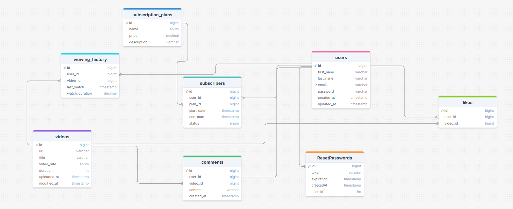

# Streaming Service Backend

The **Streaming Service Backend** is a scalable and secure video streaming backend, designed for a Netflix-like experience. This backend handles video uploads, role-based access control, subscription-based viewing, and Cloudinary integration for optimized streaming.

**Note**: This project is still in development. New features are being added, and improvements are continuously being made.

---

## 

---

## Features

### Role-Based Access Control (RBAC)

- **Admins** can upload and manage videos.
- **Subscribers** can stream videos based on their subscription plan.
- **Non-subscribers** have limited or no access to premium content.

### Secure & Efficient Video Uploads

- **Pre-Signed URLs** → Admins upload videos **directly** to Cloudinary (no backend overload).
- **Webhook-Driven Processing** → The backend listens for Cloudinary’s **webhook** to track upload status.

### Subscription & Payment Integration

- Supports **subscription plans** for accessing premium videos.
- Uses **Stripe** for secure payment processing.
- Tracks **subscription status** for each user.

### Webhook Integration with Cloudinary

- The backend listens for **Cloudinary's webhook** to receive video upload status.
- Updates the **database automatically** when a video is processed.
- Enables **async processing** for a smooth user experience.

### Secure Authentication & Authorization

- Uses **JWT (JSON Web Token)** for user authentication.
- Protects **video access** based on user roles.
- Integrates **subscription-based access** with a payment gateway.

### User Engagement Features

- **Like/Dislike** videos.
- **Add to Watchlist** for later viewing.
- **Rate & Review** videos.
- **Enable Subtitles** for a better viewing experience.

---

## Project Setup

```bash
$ npm install
```

## Compile and Run the Project

```bash
# development mode
$ npm run start

# watch mode
$ npm run start:dev

# production mode
$ npm run start:prod
```

---

## **API Endpoints**

### **Upload Video**

#### 1) Request Presigned URL

**Endpoint:** `GET /video/signed-url?tags=nestjs course from nestjs website|Learn NestJS from the official website`

**Note**: The tags consist of the title and description of the video, separated by a `|`.

**Response:**

```json
{
  "cloud_name": "dgfagvqwo",
  "api_key": "576485119445155",
  "signature": "dac9c8cec85e48cf8c6d49f70ced2b72930a6a2c",
  "timestamp": 1738584921000,
  "tags": [
    "nestjs course from nestjs website|Learn NestJS from the official website"
  ],
  "folder": "videos"
}
```

#### 2) Upload Video to Cloudinary

**Endpoint:** `POST https://api.cloudinary.com/v1_1/dgfagvqwo/video/upload`

```form-data
// form-data not JSON

"file": The Video
"cloud_name": "dgfagvqwo",
"api_key": "576485119445155",
"signature": "dac9c8cec85e48cf8c6d49f70ced2b72930a6a2c",
"timestamp": 1738584921000,
"tags": [
  "nestjs course from nestjs website|Learn NestJS from the official website"
],
"folder": "videos"
```

**Response:**

```json
{
  ...
  "url": "http://res.cloudinary.com/dgfagvqwo/video/upload/v1738584936/videos/xtdwilpdrikmrvwcmjsj.mp4",
  "secure_url": "https://res.cloudinary.com/dgfagvqwo/video/upload/v1738584936/videos/xtdwilpdrikmrvwcmjsj.mp4"
  ...
}
```

**Note**: The backend will trigger the uploaded file and automatically store the link in the database.

---

### **Authentication Routes**

#### **1. User Signup**

**Endpoint:** `POST /auth/signup`  
**Description:** Creates a new user account.

**Request Body:**

```json
{
  "firstName": "Amr",
  "lastName": "Mubarak",
  "email": "amrrdev@gmail.com",
  "password": "password"
}
```

**Response:**

- `201 Created` – User successfully registered.
- `400 Bad Request` – Email already in use or validation failed.

---

#### **2. User Login**

**Endpoint:** `POST /auth/login`  
**Description:** Authenticates a user and sets a JWT in an **HTTP-only cookie** for secure authentication.

**Request Body:**

```json
{
  "email": "aamr46095@gmail.com",
  "password": "password"
}
```

**Response Headers:**

```http
Set-Cookie: accessToken=your-jwt-token; HttpOnly; Secure; SameSite=Strict; Path=/
```

**Response Body:**

```json
{
  "message": "Login successful"
}
```

### **Security Details:**

- **HttpOnly** – Prevents JavaScript access, reducing XSS risks.
- **Secure** – Ensures the cookie is only sent over HTTPS.

**Response Codes:**

- `200 OK` – Login successful, JWT stored in the cookie.
- `401 Unauthorized` – Invalid credentials.

---

#### **3. Request Password Reset**

**Endpoint:** `POST /auth/reset-password`  
**Description:** Sends a password reset link to the user's email.

**Request Body:**

```json
{
  "email": "aamr46095@gmail.com"
}
```

**Response:**

- `200 OK` – Reset email sent successfully.
- `404 Not Found` – No account associated with this email.

---

#### **4. Change Password Using Reset Token**

**Endpoint:** `POST /auth/change-password?token=yourtoken`  
**Description:** Allows a user to set a new password using a reset token sent via email.

**Request Body:**

```json
{
  "password": "new password"
}
```

**Response:**

- `200 OK` – Password successfully changed.
- `400 Bad Request` – Invalid or expired token.

---

### **Subscription & Payment Routes**

#### **1. Create Subscription**

**Endpoint:** `POST /subscriptions/create-subscription/:plan`  
**Description:** Creates a subscription for the user based on the selected plan (`Basic` or `Premium`).

**Request:**

```http
POST /subscriptions/create-subscription/Basic
```

**Response:**

```json
{
  "subscriptionId": "sub_1Qot3CRYE1qXSm2xyRGohJ60",
  "status": "incomplete",
  "paymentIntentId": "pi_3Qot3DRYE1qXSm2x17h6Y6DZ",
  "clientSecret": "pi_3Qot3DRYE1qXSm2x17h6Y6DZ_secret_Qv0elDYlbFQbaDXNJk8OySmri"
}
```

---

#### **2. Confirm Payment**

**Endpoint:** `POST /subscriptions/confirm-payment`  
**Description:** Confirms the payment for the subscription.

**Request Body:**

```json
{
  "paymentIntentId": "pi_3Qot3DRYE1qXSm2x17h6Y6DZ"
}
```

**Response:**

```json
{
  "status": "succeeded"
}
```

---

#### **3. Webhook for Stripe Events**

**Endpoint:** `POST /subscriptions/webhook`  
**Description:** Handles Stripe webhook events (e.g., payment success, payment failure).

**Request Headers:**

```http
stripe-signature: your-stripe-signature
```

**Request Body:**

```json
{
  // Stripe event data
}
```

### **Comment Routes**

#### Create Comment

**Endpoint:** `POST /api/v1/comments`

**Request Body:**

```json
{
  "videoId": 2,
  "content": "this is comment for amrrdev1@gmail.com"
}
```

**Response:**

```json
{
  "id": 4,
  "content": "this is comment for amrrdev1@gmail.com",
  "createdAt": "2025-02-05T21:02:12.509Z",
  "updatedAt": "2025-02-05T21:02:12.509Z",
  "userId": 57,
  "videoId": 2
}
```

#### Get Comments on Video

**Endpoint:** `GET /api/v1/comments/{videoId}`

**Response:**

```json
[
  {
    "id": 1,
    "content": "this is comment",
    "createdAt": "2025-02-05T20:17:48.178Z",
    "updatedAt": "2025-02-05T20:17:48.178Z",
    "userId": 59,
    "videoId": 3
  }
]
```

#### Delete Comment

**Endpoint:** `DELETE /api/v1/comments`

**Response:**

```json
{
  "commentId": 2,
  "videoId": 3
}
```

---

### **Like/Dislike Routes**

#### Like a Video

**Endpoint:** `POST /api/v1/likes/{videoId}`

**Response:**

```json
{
  "message": "You seem to enjoy this video! 🎥 (4)"
}
```

#### Dislike a Video

**Endpoint:** `DELETE /api/v1/likes/{videoId}`

**Response:**

```json
{
  "message": "You have disliked the video successfully."
}
```

**Response:**

- `200 OK` – Webhook processed successfully.

---

## TODO

- **Movie & TV Show Categories** – Consider adding genres (e.g., Action, Comedy).
- **Profiles for Multiple Users** – Allows multiple profiles under one account.
- **Watchlist (Favorites)** – Users should be able to save videos for later.
- **Streaming vs. Download** – Will users be able to download for offline viewing?
